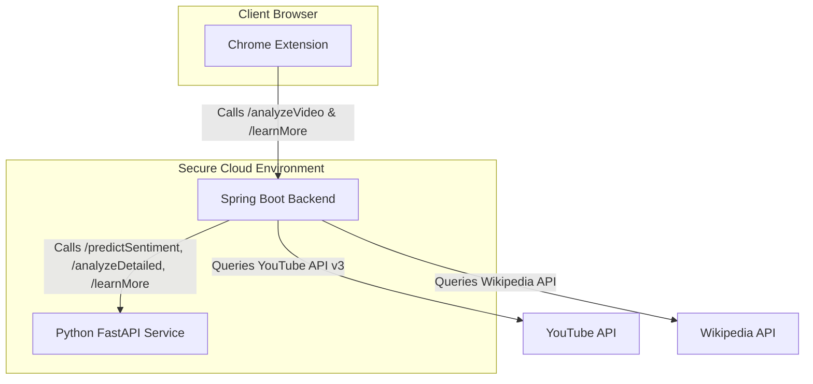

# 🛡️ YouTube Content Quality Analyzer

A multi-tiered AI-powered Chrome Extension that helps users analyze comment threads to determine the true content quality of any YouTube video. It evaluates videos based on sentiment, explanation clarity, content depth, and audience engagement, protecting users from clickbait and low-quality tutorials.

---

## 🏛️ System Architecture

The application is split into three main components:
1. **Chrome Extension (Frontend)**: Injects an analytical dashboard directly into the YouTube player interface.
2. **Spring Boot Backend (Orchestration Server)**: Handles secure API communications with YouTube, Wikipedia, and the Python NLP microservice. Hosted on **Render**.
3. **Python AI Service (FastAPI)**: Performs Natural Language Processing (NLP) sentiment scoring (VADER) and dynamic topic roadmap generation. Hosted on **Render**.

---

## 🚀 How to Install & Test (For Recruiters / Evaluators)

Because the backend servers are hosted 24/7 in the cloud, you **do not** need to set up any databases, Java, or Python runtimes on your local machine to test this project. You only need to load the Chrome Extension.

### 📥 1. Download the Extension
1. Go to the **Releases** section on the right side of this repository page.
2. Download the latest `chrome_extension.zip` asset.
3. Extract the downloaded `.zip` file into a folder on your computer.

### 🔌 2. Load the Extension into Google Chrome
1. Open Google Chrome and navigate to `chrome://extensions/`.
2. Turn on the **Developer mode** toggle in the top-right corner.
3. Click the **Load unpacked** button in the top-left corner.
4. Select the extracted `chrome_extension` folder.

### 🔍 3. Test on YouTube
1. Go to [YouTube](https://www.youtube.com) and click on any educational or programming video.
2. A card will be injected next to the YouTube player. Click **Analyze Video Quality** to run the AI analysis!
3. Click **Learn More** to get roadmaps, summaries, and related video quality rankings.

---

## 🔒 Security & Secret Management

All API credentials (Google Cloud YouTube API and Gemini AI keys) are stored securely as environment variables on the **Spring Boot backend hosting environment (Render)**. They are never exposed to the client browser or pushed into the GitHub repository, preventing key leakage and unauthorized quota usage.
